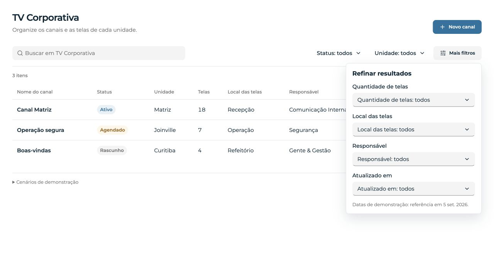
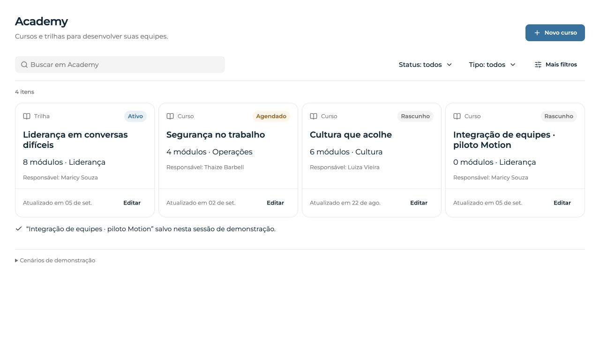

# Motion pilot — Hywork

Experimento aprovado em 5 set. 2026, sobre `0062931`, branch
`codex/interface-craft`. Apenas Storybook; sem deploy, migração ou promoção
para o pacote distribuído. Componentry foi referência, não código importado.

## Ver e experimentar

Com `npm run storybook` neste checkout:

- [TV Corporativa — movimento](http://localhost:6006/iframe.html?id=pilots-motion-experiment--tv-corporativa&viewMode=story)
- [Academy — movimento](http://localhost:6006/iframe.html?id=pilots-motion-experiment--academy&viewMode=story)
- [Contrato executável](http://localhost:6006/iframe.html?id=pilots-motion-experiment--motion-contract&viewMode=story)

Selecione um status, acrescente outro filtro e remova os chips; abra e reabra
“Mais filtros”. No Academy, crie um rascunho e salve. O cenário “Falhar próximo
salvamento” permite conferir erro e retry. Dados são fixtures e persistem só
na aba. Os pilotos originais continuam disponíveis sem a opção de movimento.

## Decisões e contraste com o estado anterior

| Antes | Depois | Por quê |
| --- | --- | --- |
| Chips surgiam/desapareciam de uma vez | Opacidade, reposicionamento e altura medida da faixa | Explicar a mudança sem atrasar o filtro |
| Painel contextual com animação genérica | Entrada de 98% a 100%, a partir da origem do Radix | Manter relação com “Mais filtros” |
| Texto de salvamento e retorno simples | Status semântico durante pending; check e confirmação ao voltar | Confirmar persistência, sem uma espera artificial de sucesso |
| Foco perdido ao remover último chip | Foco retorna à busca no piloto | Evitar queda no body e manter operação por teclado |

Emil e Impeccable orientaram o uso contextual: sem bounce, animação de linhas
da tabela ou mudança de identidade. Durações vêm dos tokens existentes:
160ms de entrada e 120ms de saída. Teclado e movimento reduzido respondem
instantaneamente; loaders mantêm a alternativa estática do DS.

Motion `13.2.0` está fixado em `devDependencies`. A biblioteca React distribuída
continua com 24.92 KB no build e sem referência a Motion. O chunk de pilotos do
Storybook inclui o motor mesmo para os pilotos originais, por compartilharem o
módulo; isolamento de carregamento não é uma entrega desta rodada. Não tratar
esse experimento como decisão de dependência para o produto.

## Evidência visual

- [Filtros mobile](screenshots/tv-filters-mobile.png)
- [Editor Academy mobile](screenshots/academy-editor-mobile.png)
- [Frames e medições reais](browser-checks.json)

Capturas sem geração ou retoque. Screenshots mostram composição, não movimento;
o contrato de browser e os frames são a evidência de continuidade.

## Verificação executada / work-log

- RED inicial: 2 testes falharam por foco perdido e ausência do status no editor.
  GREEN: corrigidos. Teste de falha/retry/deduplicação também passa.
- RED adicional: preferência reduzida alterada durante sessão não atualizava a
  policy. GREEN com listener de `matchMedia.change` e cleanup.
- `npm run check` final: exit 0; tokens, manifesto, TypeScript, build da biblioteca,
  20 testes Node e 58 testes Vitest passaram, sem aumentar timeouts.
- `npm run build`: exit 0, biblioteca e Storybook. Persistem avisos de chunks
  grandes, configuração npm `allow-scripts` e profiling de plugins do Vite.
- Uma execução intermediária atingiu o timeout de 5s em um teste antigo do
  Academy. Seus oito testes passaram isolados; a suíte completa original passou
  depois. Dois erros de TypeScript nos adaptadores/teste foram corrigidos antes
  do gate final; não houve relaxamento de tipos.
- Contrato em browser: `passed-full` e `passed-reduced`; abre duas vezes,
  observa opacidade interpolada, testa abertura por teclado e retorno do Escape.
- Desktop 1280×720 e mobile 390×844. Mobile sem overflow horizontal da página;
  painel com 352px. Montserrat confirmada na superfície do produto.
- Botão mobile medido antes e durante pending: 219.484375px, altura 44px.
  Persistência confirmada antes do aviso; foco retornou a “Novo curso”.
- Detector Impeccable: nenhuma ocorrência na rodada. Verificação AST: nenhum
  binding de import duplicado. Sem novo hex ou debug log nos arquivos de UI.
- Lockfile preserva todos os pacotes preexistentes; somente Motion e três
  dependências transitivas foram acrescentados. Metadados `libc` removidos pelo
  npm local foram restaurados, sem mudar versões existentes.

## Revisão adversarial e correções

O revisor independente apontou dois P2, confirmados antes da correção:

1. `motion.create(PopoverContent)` consumia o estado inicial antes do conteúdo
   Radix existir. Agora o elemento Motion monta dentro de `PopoverContent asChild`.
2. O hook da versão instalada não assinava mudanças de preferência. O piloto
   acompanha `change` e relê tokens quando o movimento completo é restaurado.

Nos frames, detectamos ainda um salto de altura (48→16px) ao retirar o último
chip com `height: auto` e `popLayout`. Altura numérica via medição/ResizeObserver
preserva o tamanho anterior durante a saída; confirmação mobile: 60→58.23→…→0.
O chip removido fica inert/aria-hidden durante a saída. Rechecagem do revisor:
sem novos achados nas correções examinadas.

## Limites

Sem Safari, aparelho físico, leitor de tela ou certificação de performance.
A transição de altura faz layout por ser uma faixa pequena e delimitada; não
aplicar esse padrão a listas longas. Evidência de frames não é benchmark de FPS.
Não foram alterados tokens públicos, APIs distribuídas, persistência real ou
gates de adoção de outubro. O próximo passo depende da avaliação visual do piloto.

Fontes técnicas: [presença no Motion](https://motion.dev/docs/react-animate-presence),
[instalação](https://motion.dev/docs/react-installation) e
[catálogo Componentry](https://componentry.dev/docs).
