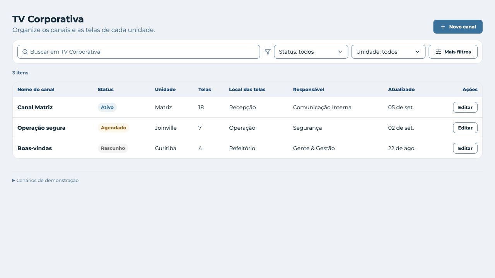
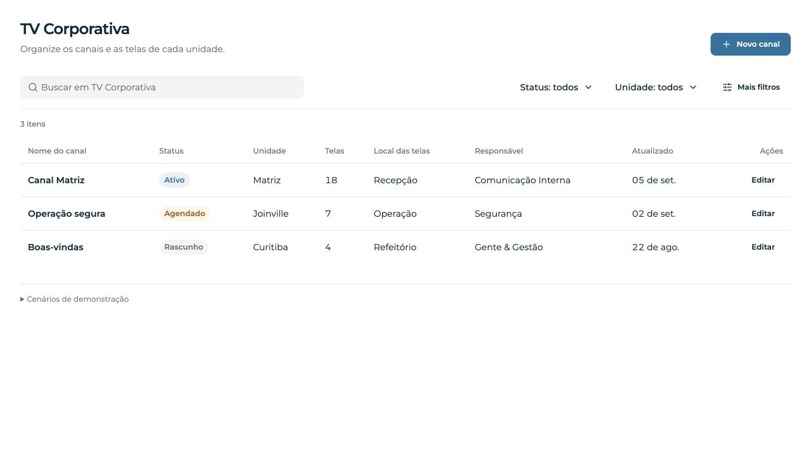
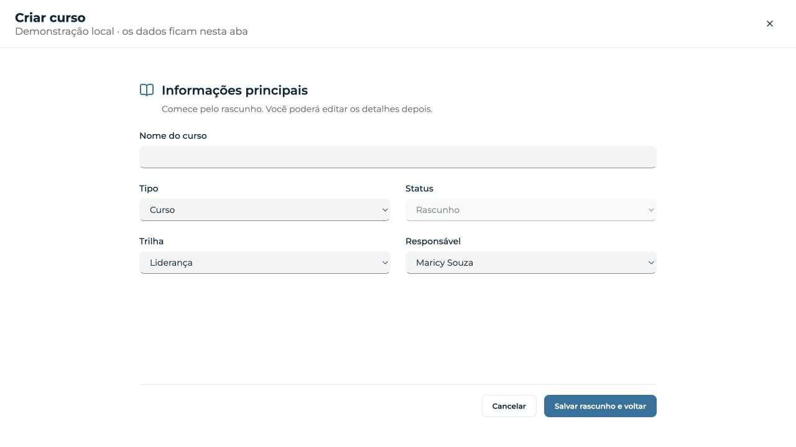
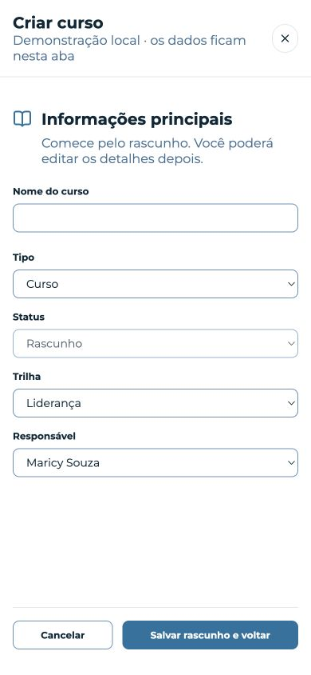
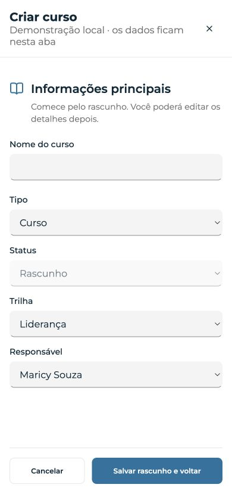

# Quiet controls — Hywork UI

5 de setembro de 2026. Direção aprovada por Vitor: “sim, bora”.

Refinamento do design system e de fixtures interativas do Storybook. Não é
migração, release, deploy ou captura do produto em produção. Montserrat,
vocabulário das features, ações e foco laranja preservados.

## Antes e depois

Mesmo viewport de 1280 × 720, mesmos dados iniciais e mesma jornada. Capturas
nativas do navegador, sem geração ou retoque por IA.

| TV Corporativa — antes | TV Corporativa — depois |
| --- | --- |
|  |  |

| Academy — antes | Academy — depois |
| --- | --- |
|  |  |

| Academy mobile — antes | Academy mobile — depois |
| --- | --- |
|  |  |

## Decisões

| Antes | Depois | Por quê |
| --- | --- | --- |
| Campos e ações com perímetro azul, toolbar dentro de uma caixa | Barra aberta, busca suave, filtros contextuais e ações quiet | Fazer o conteúdo dominar a composição |
| Campo de edição como caixa branca contornada | Preenchimento neutro, linha inferior identificável e label visível | Retirar o excesso de linhas sem esconder onde digitar |
| Foco competindo com perímetro azul | Anel laranja de 2px, offset de 2px | Um sinal de interação; invalid conserva também a linha de erro |
| Rótulos e cabeçalhos densos em negrito | Pesos 500/600, metadados neutros e melhor separação | Hierarquia sem depender de bordas ou azul em todo texto |
| Remoção de filtro com alvo de 14 × 14px | Alvo de 32 × 32px no desktop, 44 × 44px no admin estreito | Melhor precisão sem ampliar o ícone |
| Admin estreito com campos de 36px e texto de 14px | Campos de 44px e entradas textuais de 16px até 640px | Toque confortável e prevenção de zoom do campo no iOS; teste em viewport, não aparelho físico |

Não houve nova biblioteca, mudança de API pública ou substituição de fluxo.
Os novos papéis `--hw-input-surface` / `--hw-input-surface-fg` reutilizam os
primitivos existentes. Preset v3 e manifesto regenerados: 146 tokens.
TV e Conteúdos continuam tabelas; Academy e Assinaturas preservam seus cards.

## Referências e uso das skills

- [Notion no Mobbin](https://mobbin.com/explore/flows/36365690-40f3-49f2-a63f-cb7800a73b8c): filtros contextuais, conteúdo sem caixas concorrentes.
- [Front no Mobbin](https://mobbin.com/explore/flows/f191e3f1-83de-4159-8085-7ef509986b05): controles operacionais compactos e superfície suave em estado ativo.
- [Linear, março de 2026](https://linear.app/now/behind-the-latest-design-refresh): diminuir a quantidade e o peso de separadores e superfícies coloridas.

Foram consultados os fluxos públicos do Mobbin; não houve acesso à biblioteca
autenticada nem instalação de conector. Impeccable orientou redução de ruído,
composição Operate e duas rodadas de revisão; Emil orientou hierarquia dos
estados, preservação de legibilidade e movimento apenas funcional. Receitas
externas não substituíram os tokens da Hywork.

## Reprodução

Com o Storybook local em 6016:

- [TV](http://localhost:6016/iframe.html?id=pilots-priority-features--tv-corporativa&viewMode=story)
- [Academy](http://localhost:6016/iframe.html?id=pilots-priority-features--academy&viewMode=story)
- [Campo inválido e busca contextual](http://localhost:6016/iframe.html?id=contracts-core-families--field-contract&viewMode=story): a story executa um regressor de foco/borda via `play` em navegador real.

O editor mostrado é de metadados. A opção “Falhar próximo salvamento”, em
“Cenários de demonstração”, permite verificar erro/retry. Dados ficam apenas
na aba e não constituem números comerciais.

## Verificação

Consulte o [work-log](work-log.md) para comandos, resultados e ressalvas.
Os screenshots de estado e o relatório de medidas ficam nesta pasta.
